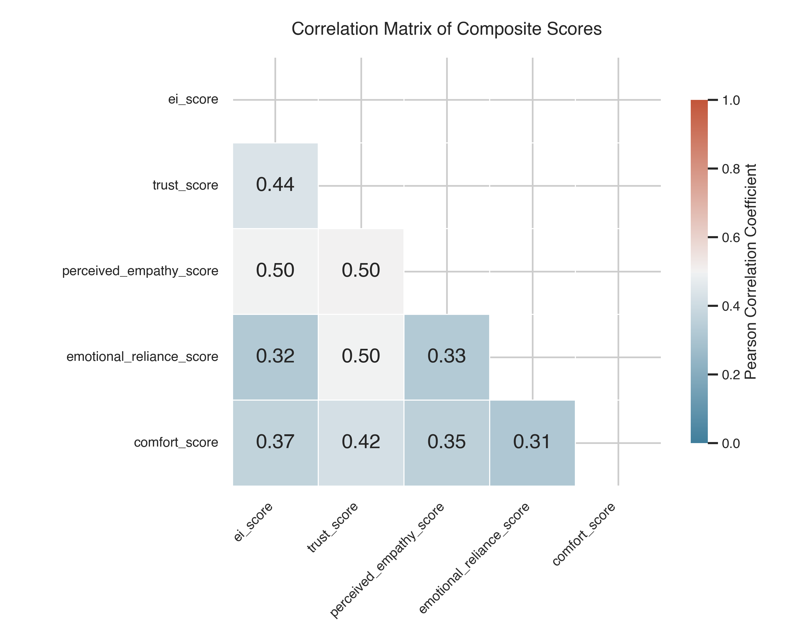
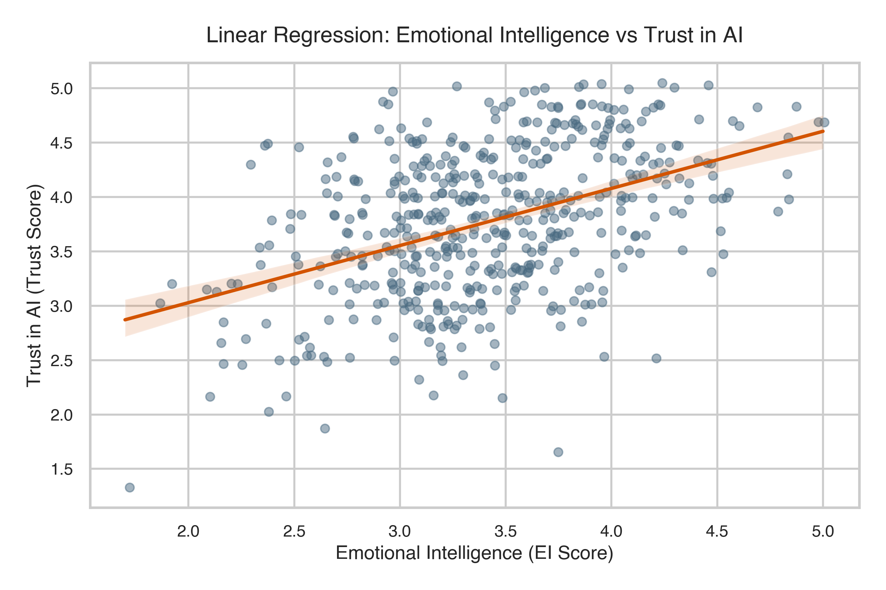
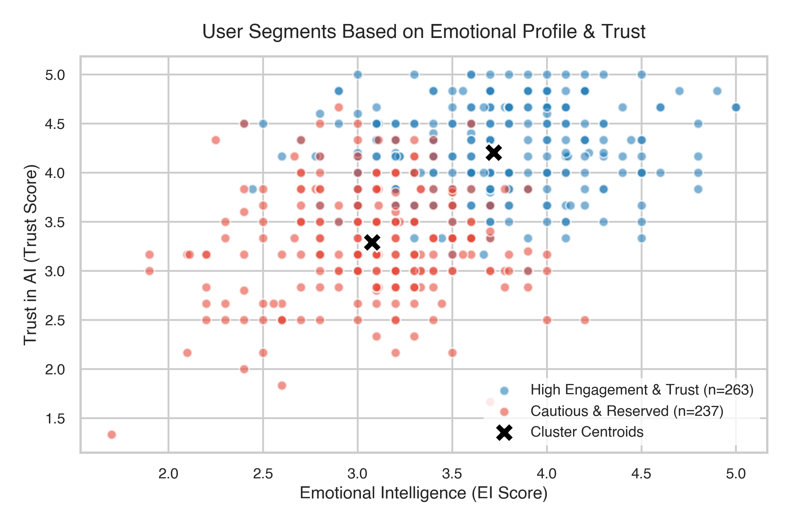

# Emotional Intelligence and Trust in Agentic AI
## A Python-Based Statistical and Behavioral Analytics Project

| Attribute | Details |
| --- | --- |
| **Author** | Rutuja Shinde |
| **Project** | Emotional Intelligence vs AI Trust Analysis |
| **Role** | Behavioral Data Analyst |
| **Date** | May 2026 |

Analyzed how emotional intelligence (EI) drives user trust in Agentic AI using statistical modeling on simulated behavioral survey data (n=500). Achieved strong predictive signals (R-squared = 21.2% for the baseline model, rising to 31.0% when accounting for perceived empathy) and segmented users into distinct trust profiles to guide emotionally intelligent AI design.

---

## Executive Summary

As AI systems become conversational and autonomous, user trust is increasingly driven by emotional factors rather than technical accuracy alone. This project investigates the psychological mechanism of trust formation in Agentic AI. It uses a structured dataset representing young adults (aged 18 to 35) to model how user Emotional Intelligence relates to trust, perceived empathy, emotional reliance, and comfort.

---

## Data Generation Methodology

To ensure analytical credibility and controlled simulation, the synthetic survey dataset (n=500) was generated using a rigorous statistical design:

1. **Multivariate Normal Simulation**: Latent psychological constructs (Emotional Intelligence, Trust, Perceived Empathy, Reliance, Comfort) were generated using a multivariate normal distribution. This allowed precise injection of predetermined covariance structures, targeting correlation coefficients (r) between 0.30 and 0.55.
2. **Likert Discretization**: The latent scores were discretized into standard 1 to 5 ordinal Likert-scale item responses (10 items for EI, 6 for Trust, 5 for Empathy, 4 for Reliance, 3 for Comfort).
3. **Response Variance Injection**: Individual item responses were perturbed with standard Gaussian noise, N(0, 0.2), to mirror human response inconsistency.
4. **Demographics**: Demographics were generated based on empirical distributions (Age uniformly distributed from 18 to 35, Gender balanced, Daily AI Usage distributed across Low, Medium, and High categories).
5. **Missingness Control**: A random 2% missingness was introduced at the item level to simulate survey non-response, which was handled during compilation via row-wise mean imputation.

---

## Project Structure

This repository follows a professional, modular Python package layout:

```text
ei_ai_trust_project/
├── synthetic_ei_ai_trust_data.csv
├── ei_ai_trust_analysis.ipynb
├── README.md
├── requirements.txt
├── src/
│   ├── __init__.py
│   ├── data_processing.py
│   ├── analysis.py
│   └── modeling.py
└── visuals/
    ├── correlation_heatmap.png
    ├── cluster_plot.png
    └── regression_line.png
```

- **src/data_processing.py**: Handles data loading, checking duplicates, resolving missing values, and internal reliability diagnostics (Cronbach's Alpha).
- **src/analysis.py**: Conducts exploratory analytics, correlation, Welch's t-test, One-way ANOVA, and K-Means segmentation.
- **src/modeling.py**: Runs multiple linear regressions and executes a formal 4-step mediation analysis with bootstrapping.

---

## Quantified Analysis & Key Results

### 1. Scale Reliability (Cronbach's Alpha)
Internal reliability testing confirms that all survey scales exceeded the standard psychometric threshold (Alpha > 0.70):
- Emotional Intelligence: Alpha = 0.871
- Trust in AI: Alpha = 0.880
- Perceived Empathy: Alpha = 0.800
- Emotional Reliance: Alpha = 0.791
- Comfort: Alpha = 0.725

### 2. Hypothesis Testing
- **Correlation (EI and Trust)**: A strong, statistically significant positive correlation was found (r = 0.436, p < 0.001), indicating that users with higher emotional intelligence show higher baseline trust.
- **Gender Differences (t-test)**: Trust did not differ significantly between Male (mean = 3.76) and Female (mean = 3.77) participants (Welch's t(487.3) = -0.128, p = 0.898).
- **AI Experience (ANOVA)**: Trust differed significantly across Daily AI Usage groups (F(2, 497) = 4.849, p = 0.008). High users showed the highest trust (mean = 3.86), followed by Medium (mean = 3.81) and Low users (mean = 3.63), suggesting familiarity-based trust.

### 3. Multiple Linear Regression (Baseline Model)
The baseline model regressed Trust in AI against EI, Age, Gender, and Daily AI Usage (R-squared = 21.2%, Adjusted R-squared = 20.3%):
- **Emotional Intelligence**: beta = 0.526, t = 10.860, p < 0.001 (Highly significant predictor)
- **Daily AI Usage (Low vs. High)**: beta = -0.258, t = -3.544, p < 0.001 (Significant negative effect of low exposure)
- **Age**: beta = 0.003, p = 0.623 (Not significant)
- **Gender (Male vs. Female)**: beta = -0.005, p = 0.932 (Not significant)

### 4. Mediation Analysis (Bootstrap & Sobel)
To understand *why* higher EI leads to higher trust, a formal mediation analysis was conducted with Perceived Empathy as the mediator (M):

- **Step 1 (Path c - Total Effect)**: EI predicts Trust (c = 0.526, p < 0.001)
- **Step 2 (Path a)**: EI predicts Perceived Empathy (a = 0.577, p < 0.001)
- **Step 3 (Path b)**: Perceived Empathy predicts Trust, controlling for EI (b = 0.380, p < 0.001)
- **Step 4 (Path c' - Direct Effect)**: EI coefficient drops but remains significant (c' = 0.306, p < 0.001), confirming **partial mediation**.
- **Indirect Effect (ab)**: ab = 0.220
  - **Sobel Test**: Z = 7.006, p < 0.001
  - **Bootstrap 95% Confidence Interval** (1000 resamples): [0.160, 0.288] (does not cross zero, indicating highly significant mediation).
  - Perceived Empathy explains **41.7%** of the total effect of EI on Trust in AI.

### 5. User Segmentation (K-Means Clustering)
A silhouette analysis determined the optimal number of segments to be 2 (Silhouette Score = 0.273):
- **Segment 0: High Engagement & Trust (n = 263)**: High emotional intelligence (mean = 3.72), high trust (mean = 4.20), high perceived empathy (mean = 3.98), high emotional reliance (mean = 4.39), and comfort (mean = 4.27).
- **Segment 1: Cautious & Reserved (n = 237)**: Lower emotional intelligence (mean = 3.08), lower trust (mean = 3.29), lower perceived empathy (mean = 3.20), lower emotional reliance (mean = 3.67), and comfort (mean = 3.59).

---

## Visualizations

### Correlation Heatmap
Displays the strength and direction of the linear relationships between composite constructs.


### Regression Analysis
Highlights the direct linear relationship between Emotional Intelligence and Trust in AI.


### User Segments
Visualizes the two distinct user profiles identified via K-Means clustering.


---

## How to Run the Project

### Prerequisites
Make sure you have Python 3.8+ installed.

### Installation
1. Clone this repository to your local machine.
2. Install the required dependencies:
   ```bash
   pip install -r requirements.txt
   ```

### Running the Analysis
You can explore the step-by-step narrative by launching the Jupyter Notebook:
```bash
jupyter notebook ei_ai_trust_analysis.ipynb
```
Alternatively, you can run or import modules from the `src/` directory directly into your Python scripts.